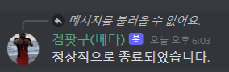

# party_bot
디스코드 채널에서 같이 게임할 파티원을 찾을 때 유용한 봇입니다.
Slash Command와 Button Interaction을 이용합니다.
golang으로 제작되었습니다.

# Details
Slash command를 사용하여 디스코드 내부에서 설명을 제공합니다.


새로운 '파티'를 열고 나면 아래와 같이 표시됩니다.


친구들이 ```드가자~```버튼을 통해 참가하거나, 참가하기로 한 친구가 ```빠꾸```버튼을 통해 취소할 수 있습니다.

파티를 연 사람은 ```폭파```버튼을 통해 파티를 닫을 수 있습니다.



# how to run
당분간은 public bot으로 운영할 계획이 없습니다.

대신 discord developer portal에서 직접 새 봇 계정을 만든 후 다음과 같이 실행할 수 있습니다.

```go run main.go -guild (YOUR_GUILD_ID) -token (YOUR_BOT_TOKEN) -app (YOUR_APPLICATION_ID)```
